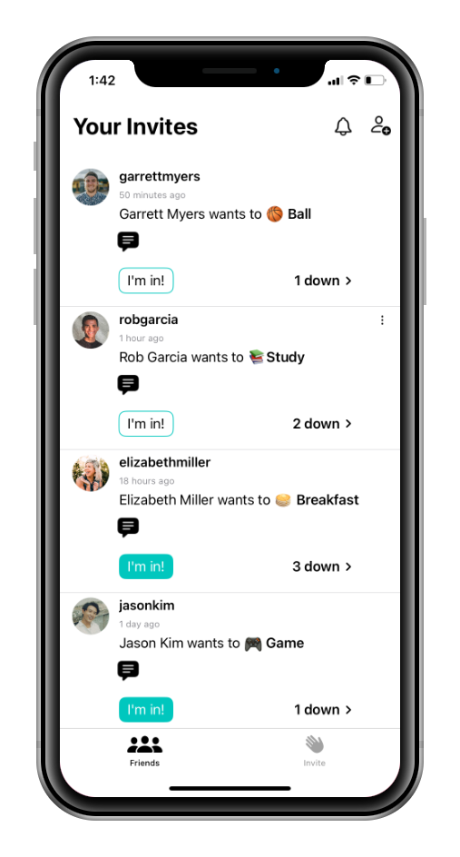
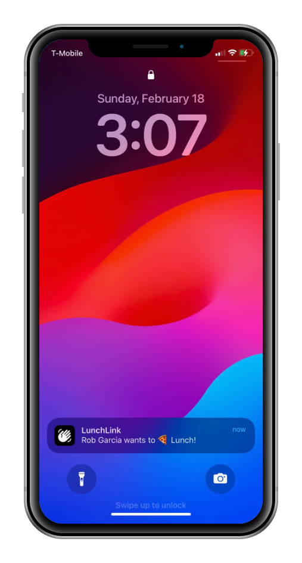
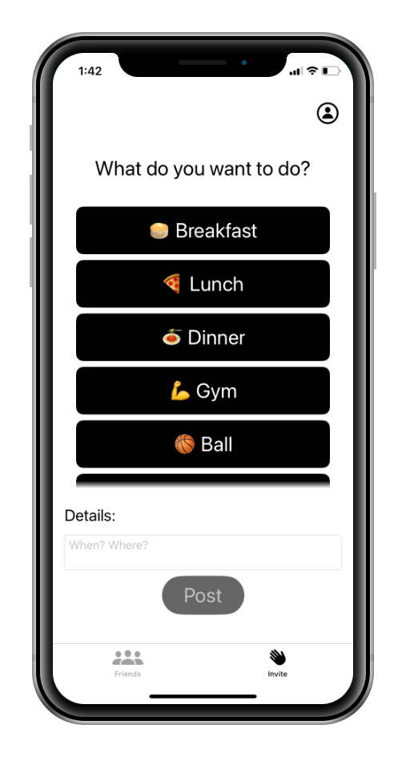

# LunchLink
LunchLink is an iOS app that allows you to let all your friends know that you're down to grab lunch, get coffee, study, go to the gym etc. If you are on campus and decide you want to grab a coffee but don't know who's free, just select 'coffee' and click post. Go to your invites page to see what plans are brewing among your friends. Get notified when you get an invite.

  
  
  

